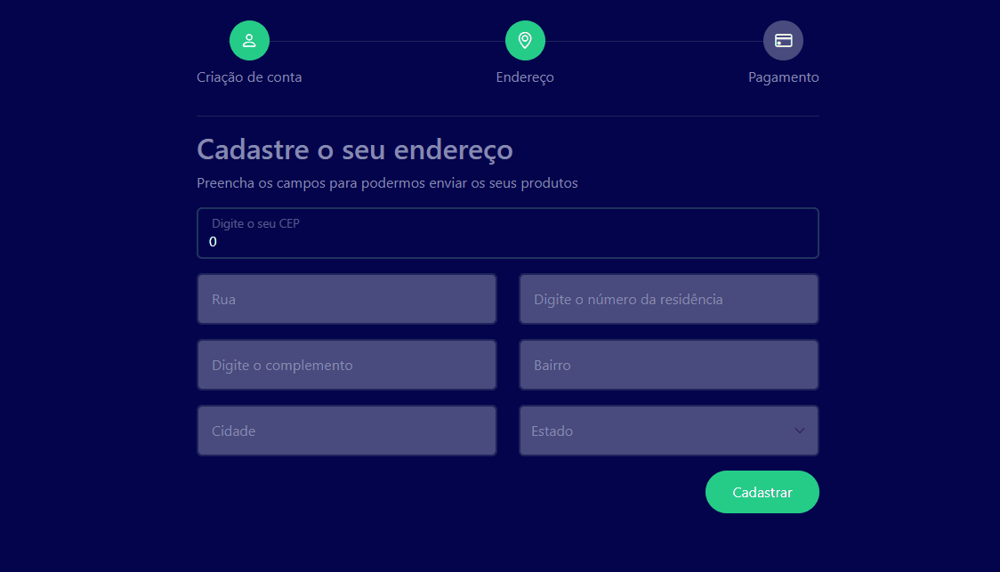

<div align="center">
  <h1>Autocomplete CEP</h1>
  <p>Projeto de uma pagina de checkout na etapa de inserção de CEP utilizando a API da ViaCEP e estilização sendo realizada utilizando o framework Bootstrap.</p>
  
</div>

# 📒 Índice
* [Descrição](#descrição)
* [Requisitos Funcionais](#requisitos)
* [Tecnologias](#tecnologias)
* [Design](#design)
  * [Cores](#cores)
  * [Fontes](#fontes)
  * [Ícones](#ícones)
* [Instalação](#instalação)
* [Licença](#licença)

# 📃 <span id="descrição">Descrição</span>
Projeto de uma pagina de checkout na etapa de inserção de CEP (Códigos de Endereçamento Postal), utilizando a API da [**ViaCEP**](https://viacep.com.br/) e para realizar as requisições é utilizado a fetch API do JavaScript e validando dados, com a estilização sendo realizada utilizando o framework [**Bootstrap**](https://getbootstrap.com/).

# 📌 <span id="requisitos">Requisitos Funcionais</span>
- [x] Requisição a API<br>
- [x] Consulta de informações de endereço<br>
- [x] Validação de dados<br>

# 💻 <span id="tecnologias">Tecnologias</span>
- **HTML**
- **CSS**
- **JavaScript**
- **Bootstrap**

# 🎨 <span id="design">Design</span>
- O modelo final para versão desktop e mobile está disponível na pasta `./design`

- <span id="cores">Cores<br></span>
  * #04044c<br>
  * #494a7d<br>
  * #fff<br>
  * #25cc88<br>
  * #8789af<br>
  * #20235b<br>

- <span id="fontes">Fontes<br></span>
  * Arial, sans-serif

- <span id="ícones">Ícones<br></span>
  * Bootstrap Icons

# 🚀 <span id="instalação">Instalação</span>
```bash
  # Clone este repositório:
  $ git clone https://github.com/CleilsonAndrade/autocomplete_cep
  $ cd ./autocomplete_cep
```

# 📝 <span id="licença">Licença</span>
Esse projeto está sob a licença MIT. Veja o arquivo [LICENSE](LICENSE) para mais detalhes.

---

<p align="center">
  Feito com 💜 by CleilsonAndrade
</p>